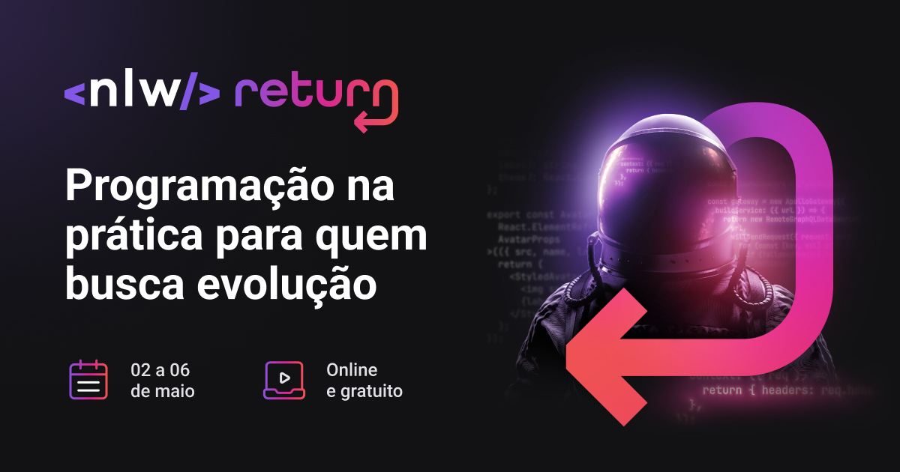

<h1 align="center">Trilha Impulse do NLW Return</h1>

  

## Sobre :pencil:

Projeto realizado durante a trilha impulse do evento Next Level Week, realizado pela [Rocketseat](https://www.rocketseat.com.br/).
O projeto é dividido em frontend e backend.

## Tecnologias usadas :rocket:

- [Frontend 🌐](./frontend):
  - [React](https://pt-br.reactjs.org/)
  - [Typescript](https://www.typescriptlang.org/)
  - [Tailwindcss](https://tailwindcss.com/)
  - [Phosphor Icons](https://phosphoricons.com/)
- [Backend 💻](./backend):
  - [Express](https://expressjs.com/pt-br/)
  - [Typescript](https://www.typescriptlang.org/)
  - [Prisma](https://www.prisma.io/)
  - [Jest](https://jestjs.io/pt-BR/)
